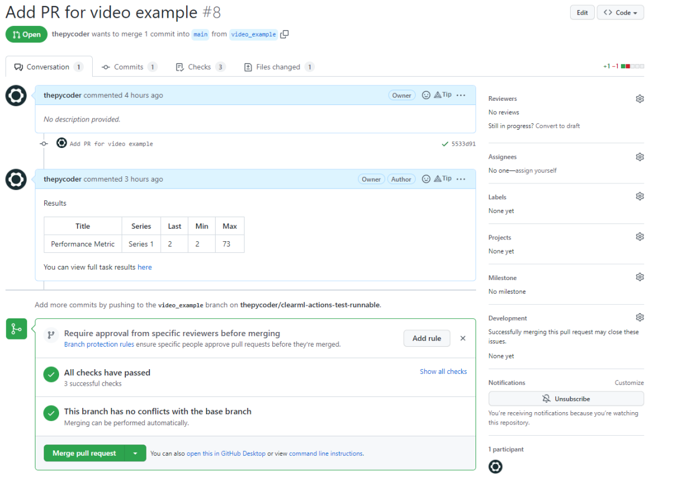
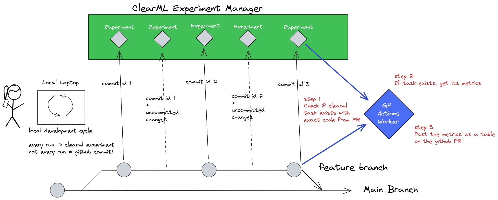

# GitHub Action For Retrieving Experiments Stats With ClearML



The goal of this Github action is to make the ClearML Metric performance of a specific PR visible, by adding a nice table as a comment on the PR. As is clear from the first sentence, this action is designed to run on a PR.

The assumption here is that when submitting a PR, the developer would have already run the code in the PR at least once locally to check that their changes actually work. If they are using ClearML this means there should be at least one task inside ClearML that meets the requirements below, if not the code is considered untested and the pipeline will fail.

The action will check if a ClearML task exists that meets the following requirements:
- The commit hash captured in the task is equal to the commit hash of the current PR
- There are NO uncommitted changes logged on the ClearML task
- The ClearML task was successful

If these are all true, then we can assume that the PR submitter has successfully ran the code from the PR locally at least once. We can now get this corresponding task and display all of its metrics in a handy table on the PR itself, to make it easier for reviewers to see what's going on (and even see the output of the code when it ran using the link to the original task!)



## Example usage

```yaml
name: Display model performance
on:
  pull_request:
    branches: [ main ]
    types: [ assigned, opened, edited, reopened, synchronize ]

jobs:
  display-model-performance: # Rename full repo as well
      runs-on: ubuntu-20.04
      steps:
        - name: Get task stats
          uses: allegroai/clearml-actions-get-stats@main
          with:
            CLEARML_API_ACCESS_KEY: ${{ secrets.ACCESS_KEY }}
            CLEARML_API_SECRET_KEY: ${{ secrets.SECRET_KEY }}
            CLEARML_API_HOST: ${{ secrets.CLEARML_API_HOST }}
            GH_TOKEN: ${{ secrets.GH_TOKEN }}
          env:
            COMMIT_ID: ${{ github.event.pull_request.head.sha }}
```

## Inputs

1. `CLEARML_API_ACCESS_KEY`: Your ClearML api access key. You can get on by following the steps [here](https://clear.ml/docs/latest/docs/getting_started/ds/ds_first_steps) or reuse one from you `clearml.conf` file. 
2. `CLEARML_API_SECRET_KEY`: Your ClearML api secret key. You can get on by following the steps [here](https://clear.ml/docs/latest/docs/getting_started/ds/ds_first_steps) or reuse one from you `clearml.conf` file. 
3. `CLEARML_API_HOST`: The ClearML api server address. If using the free tier, that's `api.clear.ml` if you have a self-hosted server, you'll have to point this to wherever it is deployed.
4. `GH_TOKEN`: A Github personal access token, used to post the comment containing the task statistics. Learn how to generate one [here](https://docs.github.com/en/authentication/keeping-your-account-and-data-secure/creating-a-personal-access-token).
